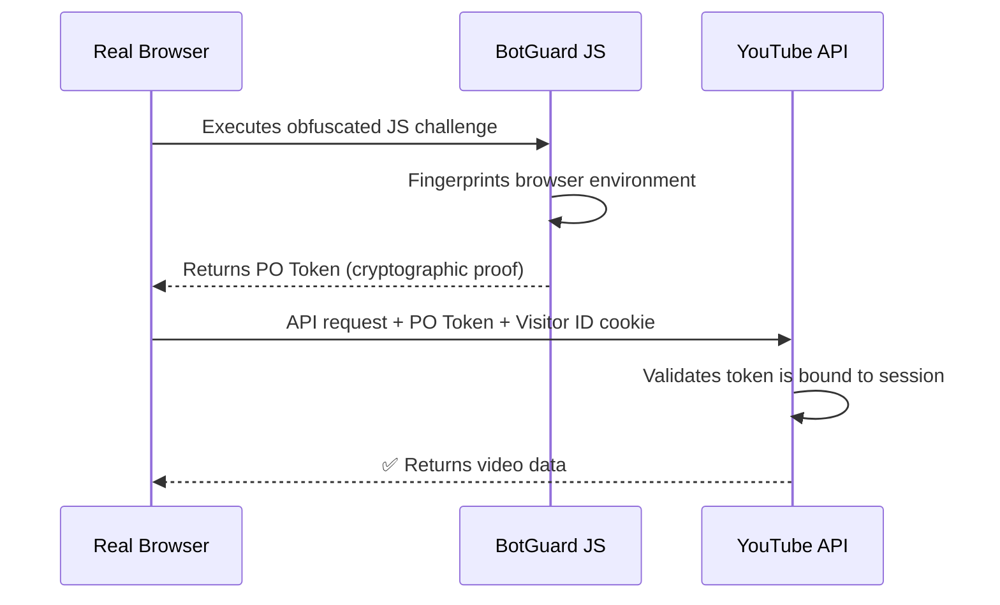

# Deployment & YouTube InnerTube Bypass Analysis

## Your Project at a Glance

| Layer | Tech | Deployment Implication |
|-------|------|----------------------|
| Frontend | React 19 (CRA) | Static build → can be hosted anywhere |
| Backend | Node.js + Express 5 | Needs a **server runtime** |
| System deps | `yt-dlp` + `ffmpeg` | **Must** be installed on the server OS |
| Storage | Local `downloads/` dir | Ephemeral FS is a problem |
| Docker | ✅ Already have a Dockerfile | Great — this is your deployment vehicle |

> [!IMPORTANT]
> Your app is **not** a typical "API-only" web service. It shells out to **system binaries** (`yt-dlp`, `ffmpeg`), writes large files to disk, and runs long CPU-intensive processes (video downloading + muxing). This rules out serverless platforms (Vercel, Netlify Functions, Cloudflare Workers) and makes even basic PaaS free tiers risky.

---

## Part 1 — Best Free Deployment Options (Ranked)

### 🥇 #1: Oracle Cloud "Always Free" (VPS) — **Best Overall**

Oracle Cloud offers the most generous permanent free tier of any major cloud provider:

| Resource | Free Allowance |
|----------|---------------|
| ARM CPU (Ampere A1) | Up to **4 OCPUs** |
| RAM | Up to **24 GB** |
| Storage | 200 GB block volume |
| Outbound data | 10 TB/month |
| Uptime | You control it — run 24/7 or shut down when idle |

**Why it's perfect for you:**
- Full Linux VM — install `yt-dlp`, `ffmpeg`, Docker, anything you want
- 24 GB RAM is overkill for 5 CCU; you could run your entire stack comfortably
- You own the filesystem — `downloads/` folder persists between requests
- No cold-start delay, no 15-minute spin-down
- Docker-ready: just `docker build` + `docker run` your existing Dockerfile

**Caveats:**
- ⚠️ ARM architecture (aarch64) — your existing Dockerfile uses `node:20-bookworm-slim` which supports ARM, so you're fine
- ⚠️ ARM instances are popular — you may need to retry creation or pick a less popular region
- ⚠️ Oracle may reclaim "idle" instances if CPU/memory/network stays below ~20% for 7 days — for a hobby project, set up a lightweight cron ping

**Deployment steps:**
1. Sign up at [cloud.oracle.com](https://cloud.oracle.com) (credit card required for identity but never charged)
2. Create an Ampere A1 instance (Ubuntu 24.04 aarch64)
3. SSH in → install Docker → `docker build` + `docker run` your server
4. Deploy your React build as static files (serve from Express, or use Nginx)
5. Open port 80/443 in both OCI Security List and OS firewall
6. (Optional) Point a free domain from Freenom or use a subdomain

---

### 🥈 #2: Render.com (Docker Web Service) — **Easiest Setup**

You already have a Dockerfile, so Render can build and deploy it directly from your GitHub repo.

| Resource | Free Tier |
|----------|-----------|
| Instances | 1 |
| RAM | ~512 MB |
| CPU | ~0.1 vCPU |
| Instance hours | 750/month |
| Storage | ❌ Ephemeral (lost on redeploy) |
| Spin-down | After **15 min** of inactivity |

**Why it works:**
- Push to GitHub → Render auto-deploys your Docker image
- Free HTTPS with custom domain support
- Zero-config CI/CD
- For 5 CCU who don't need 24/7, the spin-down is acceptable

**Caveats:**
- ⚠️ **Cold start: 30-60 seconds** when waking from sleep — your first user will wait
- ⚠️ **512 MB RAM** is tight for `yt-dlp` + `ffmpeg` — 4K video muxing may OOM-kill
- ⚠️ **Ephemeral filesystem** — files in `downloads/` are lost on redeploy. You'd need to stream directly to the user instead of caching on disk
- ⚠️ **~0.1 vCPU** — video processing will be extremely slow
- ⚠️ YouTube may **flag Render's datacenter IPs** as bot traffic

**Deployment steps:**
1. Push repo to GitHub
2. Connect repo on [render.com](https://render.com)
3. Select "Web Service" → "Docker" → point to `server/Dockerfile`
4. Set env var `PORT=5000`
5. Deploy React build separately as a "Static Site" (free)

---

### 🥉 #3: Fly.io — **No Longer Free, But Cheap ($2-5/mo)**

Fly.io deprecated its free tier in 2024. New accounts get a trial of **2 VM hours or 7 days** only.

After that, the minimum cost for an always-on small instance is ~$2-5/month. It's Docker-native, fast, and very developer-friendly, but **it's not free**.

> [!NOTE]
> Only consider Fly.io if you're willing to pay a small amount. For a truly free option, go with Oracle Cloud or Render.

---

### Honorable Mention: Self-host on an old laptop/Raspberry Pi

If you have spare hardware at home:
- Install Ubuntu + Docker
- Run your app locally
- Use [Cloudflare Tunnel](https://developers.cloudflare.com/cloudflare-one/connections/connect-networks/) (free) to expose it to the internet without port forwarding
- Zero cost, full control, residential IP (better for YouTube)

---

### Comparison Table

| Criteria | Oracle Cloud | Render | Fly.io | Self-host |
|----------|-------------|--------|--------|-----------|
| **Cost** | Free forever | Free | ~$3/mo | Free (hw cost) |
| **CPU** | 4 OCPU ARM | ~0.1 vCPU | Shared | Your hardware |
| **RAM** | 24 GB | 512 MB | 256 MB+ | Your hardware |
| **Storage** | 200 GB persistent | Ephemeral | 1-3 GB | Unlimited |
| **Cold start** | None | 30-60s | None (paid) | None |
| **Docker** | ✅ | ✅ | ✅ | ✅ |
| **Setup difficulty** | Medium | Easy | Easy | Medium |
| **YT IP flagging risk** | High (datacenter) | High (datacenter) | High (datacenter) | Low (residential) |
| **Best for** | Full control, heavy workloads | Quick demo, light use | Small paid projects | Maximum freedom |

> [!TIP]
> **My recommendation:** Go with **Oracle Cloud Always Free** for your primary deployment. It gives you the most headroom for `yt-dlp` + `ffmpeg` workloads, persistent storage, and no cold starts — all free. Deploy the React frontend as static files served by Express or Nginx on the same instance.

---

## Part 2 — How yt-dlp Bypasses YouTube's InnerTube Check (And How You Can Too)

### What is InnerTube?

InnerTube is YouTube's **internal API** — the same API that the YouTube website, mobile apps, and embedded players use to fetch video metadata, stream URLs, and player configurations. Every time you watch a YouTube video, your browser calls InnerTube endpoints like:

```
https://www.youtube.com/youtubei/v1/player
https://www.youtube.com/youtubei/v1/browse
```

### What is BotGuard?

YouTube uses **BotGuard** (web) and **DroidGuard** (Android) to detect automated/bot requests. Here's the flow:



When **yt-dlp** (or your server) makes the same API call **without** this token, YouTube sees:
- No BotGuard challenge was solved
- Request comes from a datacenter IP
- No browser fingerprint

Result: **HTTP 403** or degraded responses (no stream URLs, age-gate blocks, etc.)

### How yt-dlp Handles This

yt-dlp uses several strategies, which have evolved over time:

#### 1. Client Spoofing
yt-dlp pretends to be different YouTube "clients" (web, mweb, android, ios, tv_embedded). Each client has different BotGuard enforcement levels:

```
# yt-dlp internally sends requests like:
{
  "context": {
    "client": {
      "clientName": "ANDROID",     # or "WEB", "MWEB", etc.
      "clientVersion": "19.09.37"
    }
  }
}
```

Some clients (like `tv_embedded` or older Android versions) historically had **weaker or no** PO token requirements. YouTube is gradually closing these gaps.

#### 2. PO Token Plugins (The Modern Solution)
Since YouTube now enforces PO tokens on most clients, yt-dlp supports **external plugins** that generate real tokens:

- **[bgutil-ytdlp-pot-provider](https://github.com/jim60105/bgutil-ytdlp-pot-provider-rs)** — runs a sidecar server that solves the BotGuard challenge using a headless browser environment
- The plugin spawns a controlled browser → executes YouTube's BotGuard JS → extracts the PO token → passes it to yt-dlp
- yt-dlp then includes this token in its InnerTube API requests

#### 3. Browser Cookie Pass-through
```bash
yt-dlp --cookies-from-browser chrome "https://youtube.com/watch?v=..."
```
By using cookies from a real browser session, yt-dlp inherits the user's authenticated session including any tokens already generated by BotGuard during normal browsing.

### How to Make This Work in YOUR Web App

Since your server calls `yt-dlp` via `execFile()`, you benefit from all of yt-dlp's built-in bypass mechanisms. Here's what you should set up:

#### Option A: PO Token Provider Sidecar (Recommended for deployment)

Add the bgutil PO token provider to your Docker setup:

```dockerfile
# In your Dockerfile, add:

# Install the yt-dlp PO token plugin
RUN pip3 install -U bgutil-ytdlp-pot-provider

# --- OR run the provider as a separate container ---
# docker run -d --name bgutil-provider -p 4416:4416 \
#   ghcr.io/jim60105/bgutil-pot:latest
```

Then yt-dlp will **automatically** detect the plugin and generate PO tokens on each request. No code changes needed in your [index.js](file:///e:/HobbyProject/youtubeToMp3Converter/server/index.js).

#### Option B: Keep yt-dlp updated (minimum effort)

The yt-dlp team pushes frequent extractor fixes. Your Dockerfile already downloads the latest release. The key things to add:

```javascript
// In your execFile calls, add --no-check-certificates and 
// use the nightly build for latest fixes
execFile(
  "yt-dlp",
  [
    "--no-cache-dir",          // Don't use cached extractor data
    "-x", "--audio-format", "mp3",
    "-o", `${filePath}.%(ext)s`,
    safeUrl
  ],
  // ...
);
```

#### Option C: Browser cookies (for self-hosting only)

If self-hosting, you can export your browser cookies and pass them:
```javascript
execFile("yt-dlp", [
  "--cookies", "/path/to/cookies.txt",
  // ... rest of args
], /* ... */);
```

> [!WARNING]
> **Don't use personal cookies on a public server** — anyone who accesses your app would be making requests under your YouTube account, which could get it banned.

### The Datacenter IP Problem

> [!CAUTION]
> **This is the biggest challenge for your deployment.** Regardless of PO tokens, YouTube aggressively flags datacenter IP ranges (AWS, GCP, Oracle, Render, etc.). Even with valid tokens, you may get throttled or blocked.
>
> **Mitigations:**
> - **Self-host at home** with a residential IP → best success rate
> - Use a **residential proxy** service (adds cost)
> - Use **Oracle Cloud** which has a slightly less-flagged IP range than AWS/GCP
> - Keep yt-dlp **nightly** updated — they constantly adapt to new blocks
> - Add **retry logic** with exponential backoff in your server code

---

## Summary & Recommended Action Plan

1. **Deploy to Oracle Cloud Always Free** — create an ARM instance, run your Docker container
2. **Install the bgutil PO token plugin** in your Dockerfile to handle InnerTube checks
3. **Keep yt-dlp on nightly builds** — update it in your Dockerfile or set up a cron job
4. **Serve the React build from the same server** — run `npm run build` and serve the static files from Express
5. **If YouTube blocks the datacenter IP** — consider self-hosting at home with Cloudflare Tunnel as a fallback
